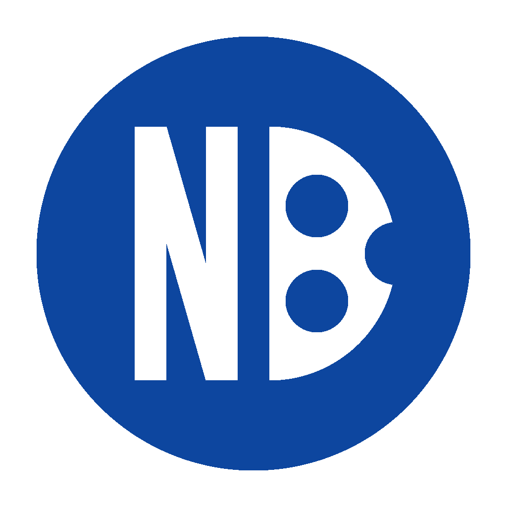

### Hi there 👋

This is newbull project.

The NewBull's symbol is NB. The open source(MIT) decentralized cryptocurrency based on blockchain technology.

You may switch the branche to 0.14.2 to git clone, and compile by yourself.

The NewBull is git clone from bitcoin and dogecoin.

This is a project to learn about blockchain and experiment with blockchain.

If you want to download precompiled binaries and blockchain data, please visit the newbull offical website: https://newbull.org

### The NewBull project is same as bitcoin project and/or dogecoin project, But with a little differences:

# 1. Total Amount

Bitcoin is 21,000,000 BTC

Dogecoin is 10,000,000,000 DOGE, and unlimited additional currency

NewBull is 2,100,000,000,000 NB, and unlimited additional currency

# 2. Rewards

### Bitcoin: 
50 BTC, and halve every 4 years

### Dogecoin: 
#### The current block reward schedule:

1–99,999: 0–1,000,000 Dogecoin

100,000–144,999: 0–500,000 Dogecoin

145,000–199,999: 250,000 Dogecoin

200,000–299,999: 125,000 Dogecoin

300,000–399,999: 62,500 Dogecoin

400,000–499,999: 31,250 Dogecoin

500,000–599,999: 15,625 Dogecoin

600,000+: 10,000 Dogecoin

#### The original block reward schedule, with one-minute block targets and four-hour difficulty readjustment:

1–99,999: 0–1,000,000 Dogecoin

100,000–199,999: 0–500,000 Dogecoin

200,000–299,999: 0–250,000 Dogecoin

300,000–399,999: 0–125,000 Dogecoin

400,000–499,999: 0–62,500 Dogecoin

500,000–599,999: 0–31,250 Dogecoin

600,000+: 10,000 Dogecoin

### NewBull:

#### The block reward schedule:

1:        1,048,576,000 NB       Genesis Block, height 0

2:        1,048,576,000 NB       First two blocks, heght 1,2

4:	      524,288,000 NB         height 3,4,5,6,7

8:	      262,144,000 NB         height 8,9,10,11,12,13,14,15

16:     	131,072,000 NB         ...

32:     	65,536,000 NB

64:     	32,768,000 NB

128:    	16,384,000 NB

256:    	8,192,000 NB

512:	    4,096,000 NB

1024:   	2,048,000 NB

2048:	    1,024,000 NB

4096:	    512,000 NB

8192:	    256,000 NB

700800: 	128,000 NB

700800:	  64,000 NB

700800: 	32,000 NB

700800: 	16,000 NB

700800:	  8,000 NB

700800:	  4,000 NB

700800:	  2,000 NB

700800:	  1,000 NB               and forever do this.

# 3. Misc:
Bitcoin: Diffculty is start with 1 I think, And adjustment every 14 days. Generate the block every 600 seconds. The algorithm is sha256d.

Dogecoin: Diffculty is start with 0x00000f, And adjustment every 4 hours. Generate the block every 60 seconds. The algorithm is same as Litecoin (scrypt).

NewBull: Diffculty is start with 0x0000ff for now***, And adjustment every 14 days. Generate the block every 180 seconds. The algorithm is same as Bitcoin (sha256d).

### *** 

I am sorry, I have lost my old version source code, and I forgot the diffculty about old version. 

I just remeber that I have tried "diff adjustment per block" and "diff addjustment every 14 days", and maybe switched between these scenarios several times.

Finally, I have choosed the "diff addjustment every 14 days", I think this solution is more scientific.

So, the -reindex can not be use. I will work on this in future.

# Warning

## 1. Qt Wallet GUI Deprecated

It's very powerful. But I developed a simple one(NewBull Wallet GUI) instead.

If you want to use the Qt Wallet GUI, you could compile with yourself.

### But please note I have just edit a few basic files, so, you may view many Bitcoin/bitcoin string.

If you mind that, please do not use the Qt Wallet GUI or you could edit some files, and then compile.

PR is welcome.

## 2. Corrupted Blockchain data file

I don't know what caused the blockchain data file to be corrupted. But it is estimated that hundreds or thousands of blocks and rewards have been lost.

So, the -reindex can not be use, and I developed a php version block parse tools to parse the transactions. I will work on this in future.

<!--
**newbull/newbull** is a ✨ _special_ ✨ repository because its `README.md` (this file) appears on your GitHub profile.

Here are some ideas to get you started:

- 🔭 I’m currently working on ...
- 🌱 I’m currently learning ...
- 👯 I’m looking to collaborate on ...
- 🤔 I’m looking for help with ...
- 💬 Ask me about ...
- 📫 How to reach me: ...
- 😄 Pronouns: ...
- ⚡ Fun fact: ...
-->
